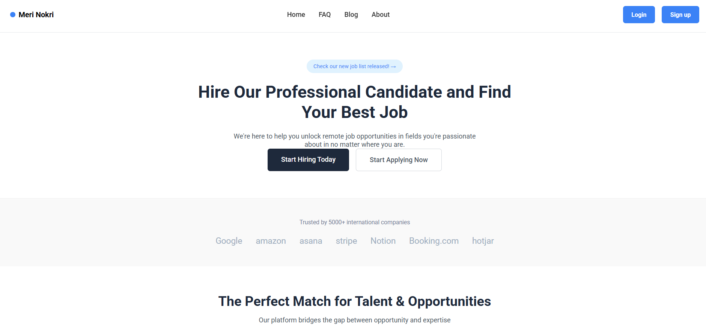
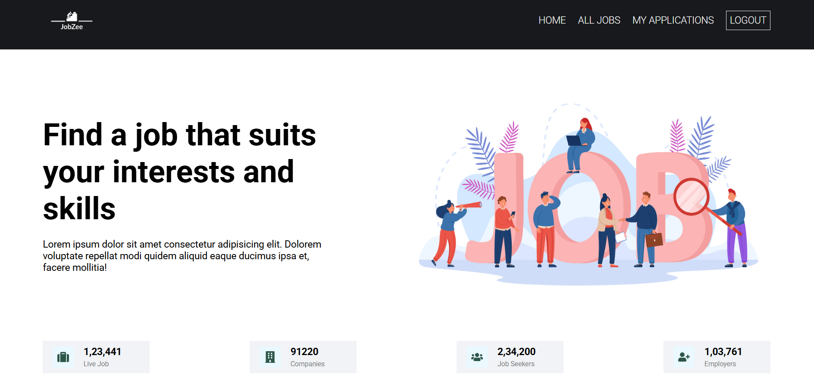
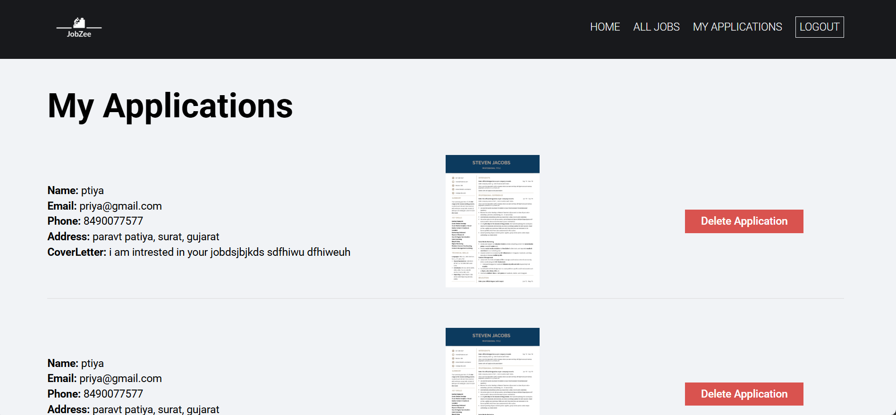
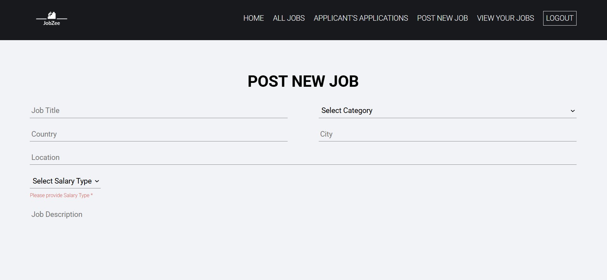
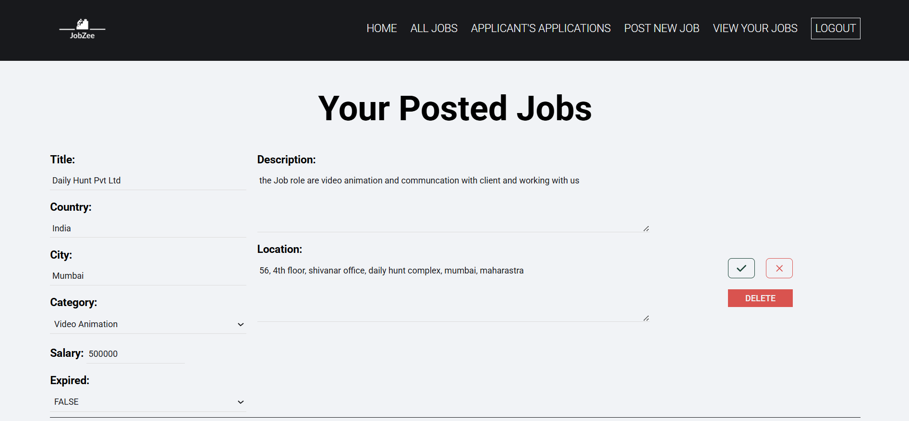
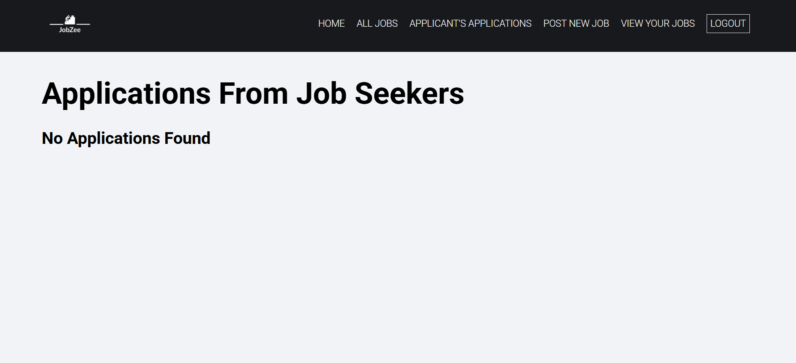
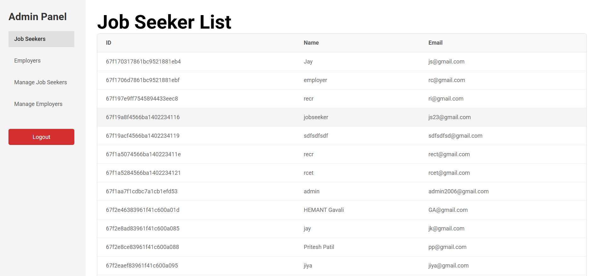
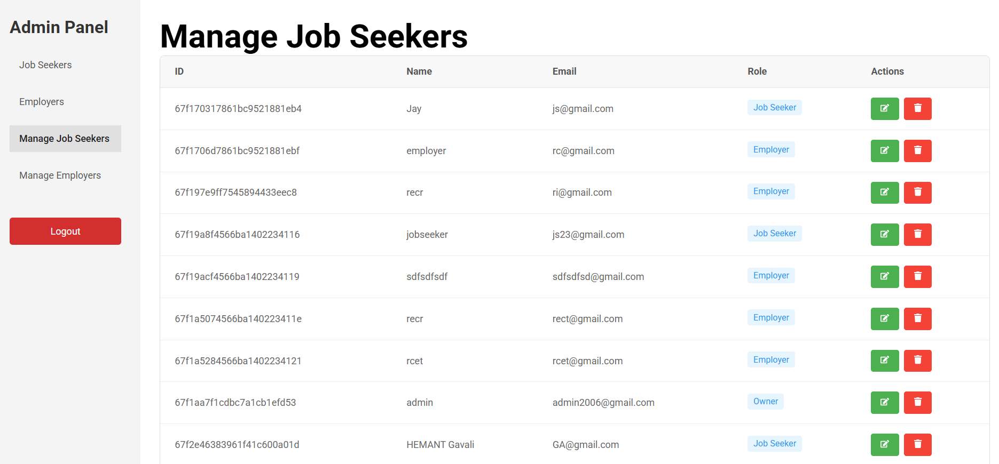
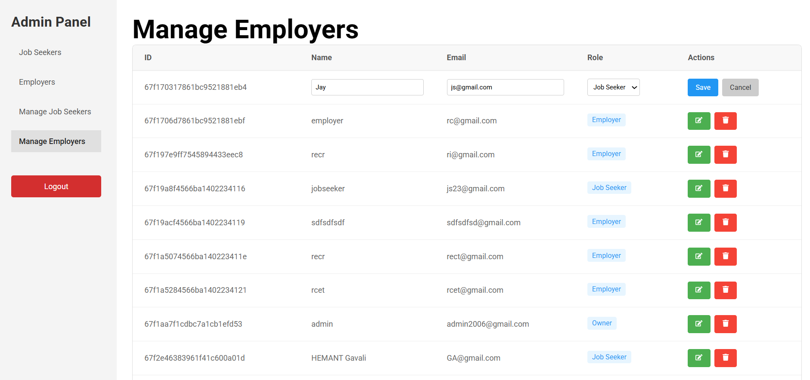

# 💼 Job Portal Web application 

A full-stack **Job Portal** web application built during my internship. This platform enables seamless interaction between **Recruiters**, **Employers**, and **Admins**, each with role-based access and feature sets.

---

## 🚀 Features

### 👤 Recruiter Module
- 🔍 Browse and apply for jobs
- 📬 Track application status
- 📝 Manage personal profile

### 🧑‍💼 Employer Module
- 📢 Post job openings with full descriptions
- 👀 View and manage applicants
- 📋 Monitor posted job listings

### 🔐 Admin Panel
- 👥 Manage all recruiters and employers
- 🛡️ Assign roles and control access
- 📊 Monitor platform-wide activity

---

## 🛠️ Tech Stack

| Layer         | Technology              |
|---------------|--------------------------|
| **Frontend**  | React.js                |
| **Backend**   | Node.js, Express.js     |
| **Database**  | MongoDB (NoSQL)         |
| **Auth**      | JWT (Role-Based Access) |
| **Media**     | Cloudinary              |
| **Testing**   | Postman                 |
| **Deployment**| Ready for hosting       |

---

## 📸 UI Screenshots

### 🔐 Login Page


### 🏠 Main Dashboard


### 🎯 Hero Section


### 📃 View Jobs (Recruiter)


### 📨 My Applications (Recruiter)


### 📝 Post a Job (Employer)


### 📌 Posted Jobs (Employer)


### 👀 View Applicants (Employer)


### 👨‍💻 View Jobseekers (Admin)


### 🛠️ Manage Jobseekers (Admin)


### 👥 Manage Recruiters (Admin)


---

## 📂 Folder Structure (Optional but useful)
```bash
├── client/                 # React frontend
├── server/                 # Node.js backend
├── .env                    # Environment variables
├── README.md               # Project overview
└── Screenshot/             # UI screenshots


🙋‍♂️ About the Developer
Hemant Gavali
MERN Stack Developer | Backend Focused | Passionate about building real-world applications


🏁 Conclusion
This project showcases:

🔄 Full CRUD operations across modules

🧑‍💼 Role-based authentication and authorization

☁️ Cloudinary integration for file uploads

📡 API-driven architecture with Postman testing

🔒 Real-world admin control and security best practices

A complete hands-on experience in building scalable, modular, and maintainable web applications.


---

### 🔧 Suggestions You Can Still Add (Optional)
- 🚧 Future Scope / Improvements (pagination, email notifications, analytics, etc.)
- 📎 Setup Instructions (if public repo)
- 🧪 Test Credentials for demo (if shared with mentor or interviewer)
- 🧭 Live Demo URL (if deployed)

Let me know if you want a **deployment section** or **setup instructions** added!
